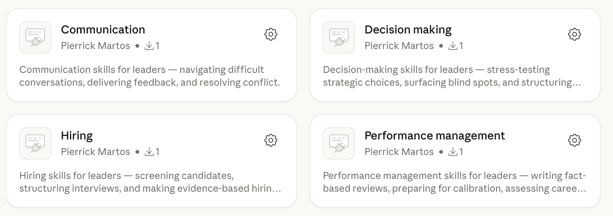

[](https://github.com/PierrickMartos/leadership-skills/blob/main/LICENSE)
[](https://github.com/PierrickMartos/leadership-skills/blob/main/CONTRIBUTING.md)

# Leadership Skills Marketplace

11 leadership skills for Claude Code, Cursor, and Claude Cowork.

**For directors, managers, leads, and ICs** who want structured help with the hard parts of leadership — decisions, communication, hiring, and performance management.



## Philosophy

These skills are designed to **identify gaps** in your initial thinking — in decisions, plans, and processes.

Use them as a tool to challenge yourself: surface blind spots, stress-test assumptions, and ask the uncomfortable questions before reality does.

## Quick Start

```shell
# 1. Add the marketplace
/plugin marketplace add pierrickmartos/leadership-skills

# 2. Install a plugin
/plugin install communication@leadership-skills

# 3. Use a skill
/communication:difficult-conversations
```

That's it. Browse all plugins below, or jump to [Usage](#usage) for more examples.

## Install

<details>
<summary><strong>Claude Code</strong></summary>

Add this marketplace:

```shell
/plugin marketplace add pierrickmartos/leadership-skills
```

Then install individual plugins:

```shell
/plugin install <plugin-name>@leadership-skills
```

</details>

<details>
<summary><strong>Cursor</strong></summary>

Add this marketplace:

```
Ctrl+Shift+P → Cursor: Add Plugin Marketplace → pierrickmartos/leadership-skills
```

Then install individual plugins from the Cursor marketplace panel.

</details>

<details>
<summary><strong>Claude Cowork</strong></summary>

1. Open **Customize** (bottom-left corner)
2. Go to **Browse plugins** → **Personal** → **+**
3. Select **Add marketplace from GitHub**
4. Enter `pierrickmartos/leadership-skills`

All plugins will be available to install from the marketplace panel.

</details>

## Usage

Invoke skills directly:

```shell
/<plugin-name>:<skill-name>
```

Browse available plugins and skills with `/help`, `/skills` or `/agents`.

**Examples:**

```
/decision-making:adversarial-review

We're planning to migrate our monolith to microservices over the next 6 months.
The goal is to scale teams independently and reduce deployment coupling.
We have 12 engineers, moderate test coverage, and no prior distributed systems experience.
```

```
/communication:difficult-conversations

I need to talk to a senior engineer who's been missing deadlines and becoming
defensive in code reviews. The team is frustrated. I've avoided the conversation for 2 weeks.
```

```
/performance-management:write-performance-review

I need to write the year-end review for Sarah, a Senior Engineer on my team.
I have her self-review, our 1:1 notes, and peer feedback from 3 teammates.
```

```
/hiring:screen-candidate-for-hm-call

I have a resume and LinkedIn profile for a senior backend engineer.
Here's the job description and what we're looking for on the team.
```

In **Claude Cowork**, skills activate automatically when relevant, or invoke them manually by typing `/` or clicking **+** during a session.

## Plugins

<details>
<summary><strong><code>decision-making</code></strong> (2 skills) — Skills for stress-testing the decisions that matter.</summary>

Claude Code: `/plugin install decision-making@leadership-skills`

| Skill | Purpose |
|-------|---------|
| `adversarial-review` | Stress-test a strategic choice by attacking it from every angle — assumptions, alternatives, risks, and second-order effects. |
| `decision-memo` | Structure a strategic decision into a clear, shareable memo — context, options, tradeoffs, recommendation, and risk. |

</details>

<details>
<summary><strong><code>communication</code></strong> (4 skills) — Skills for communicating clearly and having the conversations that matter.</summary>

Claude Code: `/plugin install communication@leadership-skills`

| Skill | Purpose |
|-------|---------|
| `bluf-communication` | Rewrite a draft message using BLUF (Bottom Line Up Front) — lead with the conclusion, cut the build-up. |
| `difficult-conversations` | Prepare for a high-stakes conversation — feedback, underperformance, conflict — with structure, clarity, and care. |
| `escalate-without-drama` | Escalate a blocker, ownership gap, or stalled dependency firmly and professionally — without blame or politics. |
| `reframe-for-execs` | Compress and reframe a detailed draft into a crisp executive-ready message — for VPs, steering committees, or the C-suite. |

</details>

<details>
<summary><strong><code>hiring</code></strong> (1 skill) — Skills for making better hiring decisions.</summary>

Claude Code: `/plugin install hiring@leadership-skills`

| Skill | Purpose |
|-------|---------|
| `screen-candidate-for-hm-call` | Screen a candidate before a hiring manager call — structured evaluation of fit, risks, and talking points. |

</details>

<details>
<summary><strong><code>performance-management</code></strong> (4 skills) — Skills for writing reviews, calibration, and career growth.</summary>

Claude Code: `/plugin install performance-management@leadership-skills`

| Skill | Purpose |
|-------|---------|
| `write-performance-review` | Write a comprehensive, evidence-based performance review — strengths-first, anchored on goals, with bias checks. |
| `write-self-review` | Help an IC write a compelling self-review that prepares them for a two-way performance conversation. |
| `assess-career-growth` | Map demonstrated behaviors against a career/competency framework to identify strengths, gaps, and development priorities. |
| `calibrate-talent` | Prepare calibration ratings (performance × potential) with evidence-backed notes and talking points for a calibration meeting. |

</details>

## Thank You

This repo was inspired by [phuryn/pm-skills](https://github.com/phuryn/pm-skills), which showed how to structure skills marketplace for product managers. It gave me the idea to build something similar for leaders.

Thanks to the following contributors for their input and support:

- [@ChuckJHardy](https://github.com/ChuckJHardy)
- [@pchasle](https://github.com/pchasle)
- [@SamirBoulil](https://github.com/SamirBoulil)

## Contributing

See [CONTRIBUTING.md](CONTRIBUTING.md).
